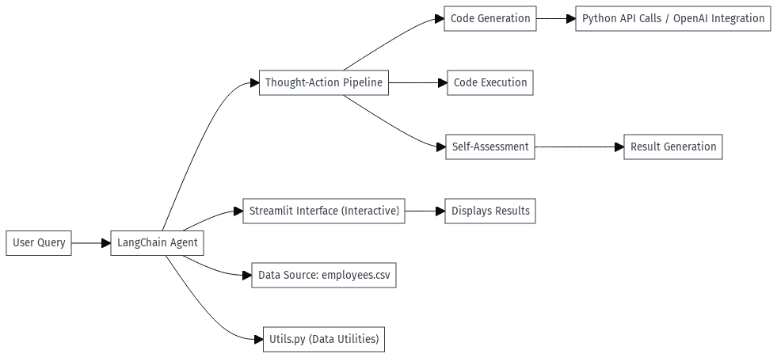

# CSV Data Analysis Project

## Overview

The CSV Data Analysis Project is a Python application designed for interactive analysis of employee data stored in CSV files. It leverages LangChain’s framework, allowing an autonomous agent to interpret user queries, generate and execute code, and verify results without manual scripting. This functionality enables rapid, efficient data analysis.

## Architecture

The project’s architecture includes key components that facilitate automated data handling and analysis. At its core, a LangChain agent manages task orchestration, handling user prompts, code generation, and result verification.



### Key Components

- **app.py**: Initializes the Streamlit interface and connects to the LangChain agent, setting up the application’s main functions.
- **utils.py**: Contains helper functions and utilities for data manipulation and aggregation.
- **requirements.txt**: Lists all dependencies required for the project.
- **employees.csv**: Primary dataset containing employee records for analysis.
- **.env** and **.env.example**: Configuration files for securely managing environment variables, such as API keys.

### Workflow

1. **User Interface**: Built with Streamlit, offering an interactive front end for data input and display.
2. **LangChain Agent**: Interprets user queries, dynamically generates code, executes it, and verifies results.
3. **Data Processing Pipeline**: Utilities in `utils.py` handle data transformation and processing.
4. **Configuration Management**: Environment variables in `.env` control configurations and securely manage sensitive information.

## Key Feature: Autonomous Code Generation

The main feature of this project is its autonomous code generation capability. The LangChain agent enables the app to interpret natural language problem statements, generate code automatically, execute it, and provide results—all without user-generated code. This setup provides fast data insights and removes the need for manually written analysis scripts.

## Technologies and Libraries

- **LangChain**: Manages thought-action cycles, providing autonomous functionality to the agent.
- **Streamlit**: Framework for creating an interactive web application.
- **OpenAI** *(Optional)*: Allows integration with OpenAI’s API for enhanced NLP processing.
- **tiktoken**: Tokenization library for NLP tasks.
- **python-dotenv**: Manages environment variables securely.
- **tabulate**: Formats tabular data for clean display.

## Installation and Setup

1. **Clone the repository**:
   - Use the command `git clone <repository-url>` and navigate to the project directory with `cd csv-data-analysis`.

2. **Install dependencies**:
   - Run `pip install -r requirements.txt` to install all necessary packages.

3. **Configure environment variables**:
   - Copy `.env.example` to `.env` and set required values:
     ```bash
     cp .env.example .env
     ```

4. **Run the application**:
   - Start the application by executing:
     ```bash
     streamlit run app.py
     ```

## Usage

Once launched, the application allows you to:

- **Upload Data**: Load new CSV files for analysis.
- **Filter and Explore**: Filter records by department, role, or other attributes.
- **Automated Insights**: Request insights; the LangChain agent interprets, generates relevant code, and provides results.
- **Natural Language Analysis** *(Optional)*: If configured, the app uses OpenAI to analyze trends or create summaries.

## Configuration Options

Settings are managed in the `.env` file:

- **OPENAI_API_KEY**: Your API key for OpenAI services.
- **DEBUG_MODE**: Enables debug logging for troubleshooting.

## Testing

To test the project, simply run:
```bash
pytest
```
The modular design of `utils.py` allows for testing individual functions to ensure reliability.

## Contributing

To contribute to this project, please fork the repository, make your changes, and submit a pull request. Ensure all contributions include unit tests and are fully documented.


